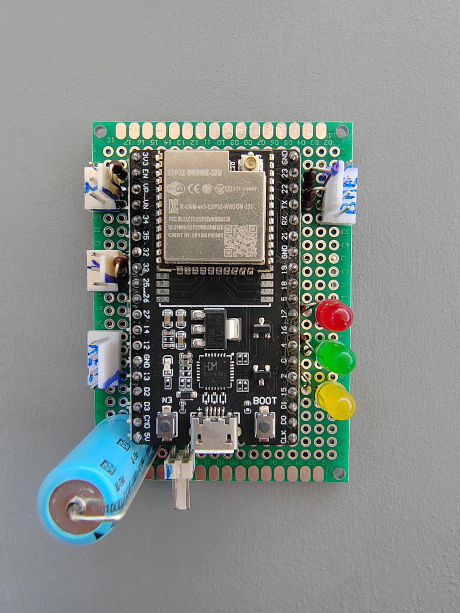

# ThetaMon3

ThetaMon3 is based on an ESP32 controller, which reads a bunch of sensors and sends the results to a MQTT-Broker, like Mosquitto. I use three probes, together with my Home Assistant installation to control the temperature in remote buildings.

## Features Overview

- Reads DS18B20 sensors arrays, connected to two channels. In the current configuration, it can read up to four sensors per channel. If you need more, simply increase DS18B20_MAX_DEVICES in Config.h.
- It also reads BME280 values, temp, hummidity and pressure.
- Currently, every channel needs at least one sensor. So a minimum configuration is two DS18B20 sensors and one BME280. 
- Based on a look-up table, placed as file image on the controller, two relays are switched, depending on the given thresholds.
- Measurements are taken every minute and the average of these measurements are sent to an Mqtt broker every five minutes.
- There is a command-line-interface, you could connect to with a terminal programm, like GTK-Term. So you can have insight, what is going on in your setup and you can change several settings with it.
- Also, there are Mqtt-channels for remote accessing the device, or read loggings.

## What's it all about? 

To understand what ThetaMon does and what it is meant for, we take a look at where the idea comes from.

My wife owns really a lot of pot-plants. These must be kept in a warmer place during the winter time, so we bring them into the garages. Unfortunately, on some days the outside temperatures could drop so low, that even in the garage the plants will die. Of course you use an electric heater, but the control of such devices is not particularly precise.
So the idea came up to build a system, that measures at different places in the room, to bring more insight how the heat is distributed and which places are save. Above that, to provide a finer regulation of the heating.

I put together the first version of ThetaMon, based on STM32F103 controllers, it consisted of two satellites and a base-station. The communication was done with NRF24 radios, which are long range capable (more or less...). The base-station was connected to an orange-pi which ran an apache webserver installation and hosted a page to show the graphs of all sensors for the last 24 hours. One very crucial point was, that the satellites work independently. If the connection to the base broke, they must capable to do the regulation. This means, that every node in the system has to keep a table with all relevant temperature-thresholds.

This system ran fine for some years, but I wanted more flexibility and insight if things went wrong. Sometimes temperature sensors failed, due to connector problems, or the NRF24 modules failed.
ThetaMon2 took a very long time to develop, and it became very complex. For example I needed an EEPROM with some kind of file-system to store the sensor tables. The html-generation was done by own code on the used Banana-Pi. Finaly it worked and it was used for one year.

In winter 2023 I took the time to try, if ESP32 with external antenna could keeo a stable connection to the Wlan. And yes, it did! Also I looked for some different possibility to do the development and found, that PlatformIO is so much powerfull. Then, a colleague showed me what he does with home automation and I came up to use Home Assistant as dashboard solution.
ThetaMon3 took only a half year of development, not only because large parts of code from TM2 have been overtaken, it turned out that PlatformIO absolutely speeds up things.

## Getting started

